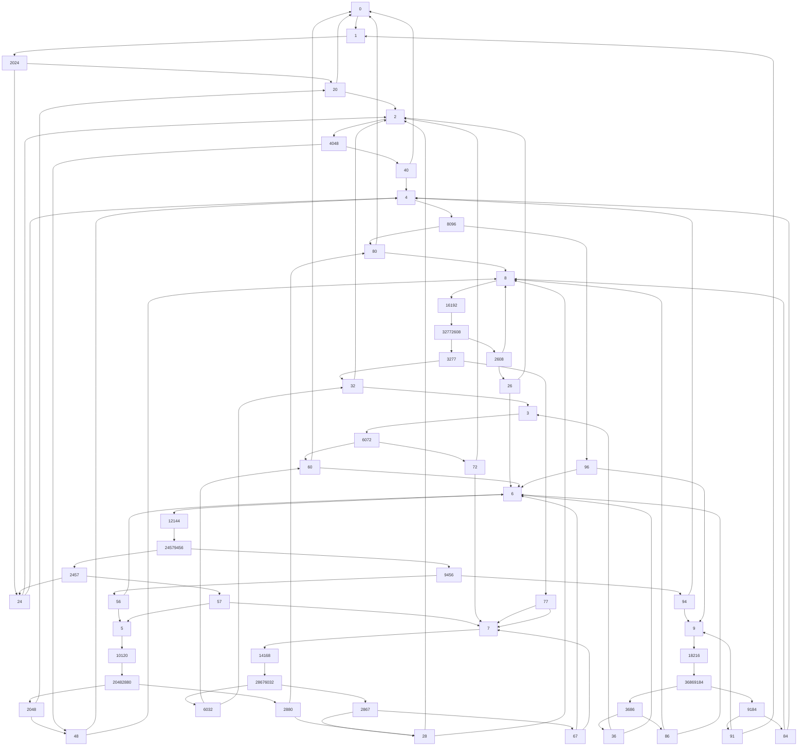

# Stone State Transitions

```mermaid
flowchart TD
    0 --> 1
    1 --> 2024
    2 --> 4048
    3 --> 6072
    4 --> 8096
    5 --> 10120
    6 --> 12144
    7 --> 14168
    8 --> 16192
    9 --> 18216
    20 --> 2
    20 --> 0
    24 --> 2
    24 --> 4
    26 --> 2
    26 --> 6
    28 --> 2
    28 --> 8
    32 --> 3
    32 --> 2
    36 --> 3
    36 --> 6
    40 --> 4
    40 --> 0
    48 --> 4
    48 --> 8
    56 --> 5
    56 --> 6
    57 --> 5
    57 --> 7
    60 --> 6
    60 --> 0
    67 --> 6
    67 --> 7
    72 --> 7
    72 --> 2
    77 --> 7
    77 --> 7
    80 --> 8
    80 --> 0
    84 --> 8
    84 --> 4
    86 --> 8
    86 --> 6
    91 --> 9
    91 --> 1
    94 --> 9
    94 --> 4
    96 --> 9
    96 --> 6
    2024 --> 20
    2024 --> 24
    2048 --> 20
    2048 --> 48
    2457 --> 24
    2457 --> 57
    2608 --> 26
    2608 --> 8
    2867 --> 28
    2867 --> 67
    2880 --> 28
    2880 --> 80
    3277 --> 32
    3277 --> 77
    3686 --> 36
    3686 --> 86
    4048 --> 40
    4048 --> 48
    6032 --> 60
    6032 --> 32
    6072 --> 60
    6072 --> 72
    8096 --> 80
    8096 --> 96
    9184 --> 91
    9184 --> 84
    9456 --> 94
    9456 --> 56
    10120 --> 20482880
    12144 --> 24579456
    14168 --> 28676032
    16192 --> 32772608
    18216 --> 36869184
    20482880 --> 2048
    20482880 --> 2880
    24579456 --> 2457
    24579456 --> 9456
    28676032 --> 2867
    28676032 --> 6032
    32772608 --> 3277
    32772608 --> 2608
    36869184 --> 3686
    36869184 --> 9184
```
